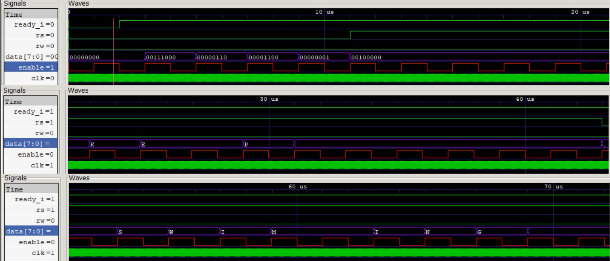
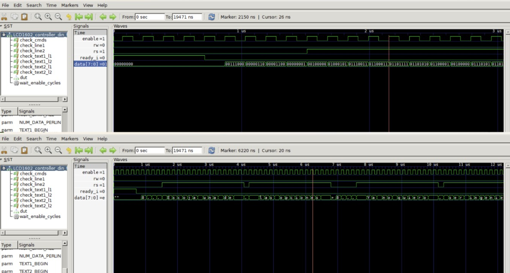
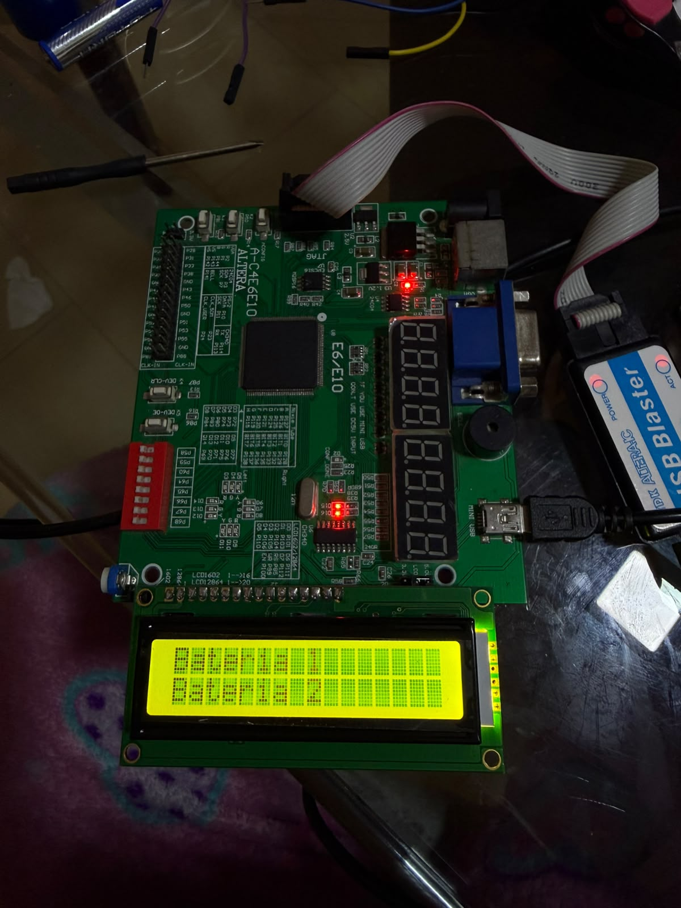
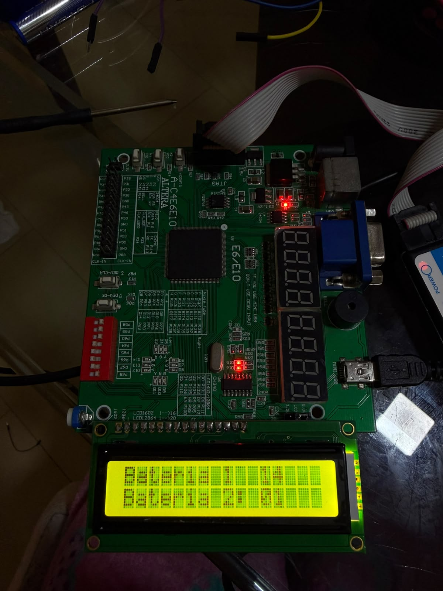

[](https://classroom.github.com/online_ide?assignment_repo_id=24235208&assignment_repo_type=AssignmentRepo)
# Lab 06 - Visualización usando pantalla LCD 16x2

# Integrantes

- Michelle Dayanna Noy Alvarado
- Laura Sofia Ruiz Constante

## Introducción

En este laboratorio se implementó el control de una pantalla LCD alfanumérica de 16 columnas y 2 filas utilizando una tarjeta FPGA Altera Cyclone IV y el lenguaje de descripción de hardware Verilog.

El funcionamiento de la pantalla LCD requiere el envío ordenado de comandos de configuración, instrucciones de posicionamiento del cursor y caracteres codificados en ASCII. Debido a esta secuencia de operación, se utilizó una máquina de estados finitos, o FSM, encargada de controlar las señales `RS`, `RW`, `Enable` y el bus de datos de la pantalla.

El laboratorio se desarrolló en dos partes. En la primera parte se implementó la visualización de texto estático, mostrando los mensajes `Bateria 1` y `Bateria 2` en las dos filas de la pantalla. Estos caracteres fueron almacenados en un archivo externo en formato hexadecimal y cargados en una memoria interna mediante la instrucción `$readmemh`.

En la segunda parte se modificó el diseño para incorporar información dinámica. Se utilizaron dos grupos de cuatro switches como entradas, permitiendo representar valores entre 0 y 15. Estos valores fueron convertidos a caracteres ASCII y actualizados continuamente en la pantalla junto al texto estático.

Finalmente, se realizaron simulaciones para verificar la secuencia de estados, los comandos enviados, la escritura de caracteres y la actualización de los datos. Posteriormente, ambos diseños fueron implementados y probados físicamente en la tarjeta FPGA.

## Materiales y herramientas

### Hardware

- Tarjeta de desarrollo FPGA Altera Cyclone IV.
- Pantalla LCD alfanumérica de 16×2.
- Cable USB para la programación de la FPGA.
- Computador.
- Switches integrados en la tarjeta de desarrollo.
- Botón de reset de la tarjeta.
- Conector o header para la pantalla LCD.
- Fuente de alimentación de la tarjeta FPGA.

### Software

- Intel Quartus Prime.
- Lenguaje de descripción de hardware Verilog HDL.
- Herramienta de simulación compatible con Verilog.
- Visualizador de formas de onda.
- GitHub para el almacenamiento y documentación del proyecto.

### Archivos utilizados en la parte 1

- `lcd1602_top.v`
- `lcd1602_text.v`
- `lcd1602_TB.v`
- `data.txt`

### Archivos utilizados en la parte 2

- `lcd1602_topp2.v`
- `lcd1602_textp2.v`
- `lcd1602_TB.v`
- `data2.txt`

 
## Marco teórico

### Pantalla LCD 16×2

Una pantalla LCD 16×2 es un dispositivo alfanumérico capaz de mostrar 32 caracteres distribuidos en dos filas de 16 posiciones cada una. Cada carácter se representa mediante una matriz de puntos y se almacena internamente en la memoria de la pantalla.

Para controlar la LCD se utilizan señales de alimentación, control y datos. En este laboratorio se empleó un bus de datos de 8 bits, por lo que cada comando o carácter se envió de forma completa a través de las líneas `data[7:0]`.

### Señales de control

Las principales señales utilizadas para controlar la pantalla son:

- `RS`: selecciona el tipo de información enviada.
  - `RS = 0`: el valor corresponde a un comando.
  - `RS = 1`: el valor corresponde a un carácter.

- `RW`: selecciona entre lectura y escritura.
  - `RW = 0`: operación de escritura.
  - `RW = 1`: operación de lectura.

- `Enable`: habilita la transferencia del comando o carácter hacia la pantalla.

En este diseño la señal `RW` permaneció en cero, debido a que únicamente se realizaron operaciones de escritura.

### Comandos de configuración

Antes de escribir información en la pantalla es necesario enviar una secuencia de comandos de configuración. Los principales comandos utilizados fueron:

| Comando | Función |
|---|---|
| `8'h38` | Configura la LCD en modo de 8 bits, dos líneas y caracteres de 5×8 |
| `8'h06` | Configura el incremento automático del cursor |
| `8'h0C` | Enciende la pantalla y desactiva el cursor |
| `8'h01` | Borra el contenido de la pantalla |
| `8'hC0` | Posiciona el cursor al inicio de la segunda fila |

La pantalla diferencia entre comandos y caracteres mediante el valor de la señal `RS`.

### Código ASCII

La LCD interpreta los datos alfanuméricos mediante códigos ASCII. Por esta razón, cada letra, número o símbolo debe enviarse utilizando su representación hexadecimal correspondiente.

Algunos ejemplos son:

| Carácter | Código ASCII hexadecimal |
|---|---|
| `B` | `42` |
| `a` | `61` |
| `1` | `31` |
| `2` | `32` |
| `:` | `3A` |
| Espacio | `20` |

En la primera parte del laboratorio, los caracteres fueron almacenados en un archivo hexadecimal y cargados en una memoria interna mediante la instrucción:

`$readmemh("data.txt", static_data_mem);`

# Parte 1: Visualización de texto estático

## Arquitectura del sistema

La primera parte del laboratorio tiene como objetivo mostrar texto estático en una pantalla LCD 16×2 utilizando una tarjeta FPGA Altera Cyclone IV.

La arquitectura del sistema está compuesta por un módulo superior, un controlador de la pantalla, una máquina de estados finitos, un divisor de frecuencia, memorias internas y contadores.

El módulo superior `lcd1602_top.v` se encarga de conectar las entradas y salidas físicas de la FPGA con el controlador de la pantalla LCD. Sus entradas principales son el reloj `clk` y la señal de reinicio `reset`. Sus salidas son `rs`, `rw`, `enable` y el bus de datos `data[7:0]`.

El controlador `lcd1602_text.v` contiene la lógica principal del sistema. Dentro de este módulo se implementan la máquina de estados, el divisor de frecuencia, la memoria de comandos, la memoria de texto y los contadores utilizados para recorrer los datos.

La memoria de comandos almacena las instrucciones necesarias para configurar la pantalla:

- `8'h38`: configura la LCD en modo de 8 bits, dos líneas y caracteres de 5×8.
- `8'h06`: configura el incremento automático del cursor.
- `8'h0C`: enciende la pantalla y desactiva el cursor.
- `8'h01`: borra el contenido de la pantalla.
- `8'hC0`: posiciona el cursor al inicio de la segunda fila.

La memoria de texto contiene 32 caracteres, distribuidos en dos grupos de 16. Estos datos se cargan desde el archivo `data.txt` mediante la instrucción `$readmemh`.

Los primeros 16 caracteres corresponden a la primera fila y los siguientes 16 corresponden a la segunda fila. El contenido mostrado es:

`Bateria 1       
Bateria 2`

El sistema también utiliza un divisor de frecuencia, debido a que la velocidad del reloj de la FPGA es mucho mayor que la velocidad de operación de la pantalla LCD. Este divisor genera una señal más lenta utilizada para controlar la máquina de estados y la señal `Enable`.

La arquitectura general del sistema puede representarse de la siguiente manera:

        clk ────────────────┐
        reset ──────────────┤
                            ▼
                  ┌───────────────────┐
                  │  Módulo superior  │
                  │ lcd1602_top.v     │
                  └─────────┬─────────┘
                            │
                            ▼
                  ┌───────────────────┐
                  │ Controlador LCD   │
                  │ lcd1602_text.v    │
                  │                   │
                  │ - FSM             │
                  │ - Divisor de clk  │
                  │ - Memoria comandos│
                  │ - Memoria texto   │
                  │ - Contadores      │
                  └─────────┬─────────┘
                            │
                  RS, RW, Enable, data
                            │
                            ▼
                  ┌───────────────────┐
                  │    LCD 16×2       │
                  │                   │
                  │ Bateria 1         │
                  │ Bateria 2         │
                  └───────────────────┘

## Máquina de estados

Para controlar la secuencia de inicialización y escritura de la pantalla LCD se implementó una máquina de estados finitos.

La máquina de estados de la primera parte está compuesta por los siguientes estados:

- `IDLE`
- `CONFIG_CMD1`
- `WR_STATIC_TEXT_1L`
- `CONFIG_CMD2`
- `WR_STATIC_TEXT_2L`
- `FIN`

### Descripción de los estados

#### Estado `IDLE`

Es el estado inicial del sistema.

En este estado se reinician los contadores y las señales de control. Cuando la entrada `ready_i` está activa, la máquina pasa al estado `CONFIG_CMD1`.

#### Estado `CONFIG_CMD1`

En este estado se envían los comandos necesarios para configurar la pantalla LCD.

Los comandos enviados son:

```text
0x38
0x06
0x0C
0x01
```

El contador `command_counter` recorre la memoria de comandos. Cuando se envía el último comando, la máquina pasa al estado `WR_STATIC_TEXT_1L`.

#### Estado `WR_STATIC_TEXT_1L`

En este estado se escriben los primeros 16 caracteres almacenados en la memoria `static_data_mem`.

Estos caracteres corresponden a la primera fila de la pantalla:

```text
Bateria 1
```

Durante este estado, la señal `RS` se mantiene en `1`, debido a que los datos enviados corresponden a caracteres ASCII.

Cuando el contador `data_counter` llega al último carácter de la primera fila, la máquina pasa al estado `CONFIG_CMD2`.

#### Estado `CONFIG_CMD2`

En este estado se envía el comando:

```text
0xC0
```

Este comando posiciona el cursor al inicio de la segunda fila de la pantalla LCD.

Después de enviar el comando, la máquina pasa al estado `WR_STATIC_TEXT_2L`.

#### Estado `WR_STATIC_TEXT_2L`

En este estado se escriben los últimos 16 caracteres almacenados en la memoria `static_data_mem`.

Estos caracteres corresponden a la segunda fila:

```text
Bateria 2
```

Cuando se escribe el último carácter, la máquina pasa al estado `FIN`.

#### Estado `FIN`

Es el estado final de la máquina.

En este estado no se envían más comandos ni caracteres. La máquina permanece en `FIN` hasta que se activa nuevamente la señal de reset.

La pantalla conserva el texto mostrado debido a que los caracteres permanecen almacenados en la memoria interna de la LCD.

### Secuencia de estados

```text
IDLE
  ↓
CONFIG_CMD1
  ↓
WR_STATIC_TEXT_1L
  ↓
CONFIG_CMD2
  ↓
WR_STATIC_TEXT_2L
  ↓
FIN
```

## Simulación

Para verificar el funcionamiento de la primera parte se utilizó el archivo `lcd1602_TB.v`, el cual permite simular el comportamiento del controlador antes de implementarlo físicamente en la FPGA.

En el testbench se genera una señal de reloj de 50 MHz mediante la instrucción:

```verilog
always #10 clk = ~clk;
```

Como la señal cambia de estado cada 10 ns, el periodo completo es de 20 ns, equivalente a una frecuencia de 50 MHz.

También se genera un pulso de reset para llevar el sistema al estado inicial:

```verilog
initial begin
    clk = 0;
    rst = 1;
    ready_i = 1;

    #10 rst = 0;
    #10 rst = 1;
end
```

La señal de reset es activa en bajo, por lo que el sistema se reinicia cuando `rst = 0`.

Durante la simulación se utilizó un valor reducido para el parámetro `COUNT_MAX`. En la implementación física se utiliza un valor de `800000`, pero en el testbench se emplea un valor menor para acelerar la simulación y observar las transiciones de la máquina de estados en menos tiempo.

Las principales señales observadas fueron:

- `clk`
- `rst`
- `clk_16ms`
- `fsm_state`
- `command_counter`
- `data_counter`
- `rs`
- `rw`
- `enable`
- `data`

La secuencia esperada durante la simulación es la siguiente:

1. Activación del reset.
2. Entrada al estado `IDLE`.
3. Envío de los comandos de configuración:
   - `0x38`
   - `0x06`
   - `0x0C`
   - `0x01`
4. Escritura de los 16 caracteres de la primera línea.
5. Envío del comando `0xC0`.
6. Escritura de los 16 caracteres de la segunda línea.
7. Entrada al estado `FIN`.

Durante el estado `CONFIG_CMD1`, la señal `RS` permanece en `0`, debido a que los valores enviados corresponden a comandos.

Durante los estados `WR_STATIC_TEXT_1L` y `WR_STATIC_TEXT_2L`, la señal `RS` permanece en `1`, debido a que los valores enviados corresponden a caracteres ASCII.

La señal `RW` permanece siempre en `0`, ya que el sistema únicamente realiza operaciones de escritura sobre la pantalla LCD.

El bus `data[7:0]` muestra primero los comandos de configuración y posteriormente los códigos ASCII correspondientes al texto:

```text
Bateria 1
Bateria 2
```

### Resultado de la simulación



La simulación permitió comprobar que la máquina de estados realiza correctamente la secuencia de configuración, escritura de la primera línea, cambio de cursor, escritura de la segunda línea y finalización del proceso.

# Parte 2: Visualización de datos dinámicos

## Arquitectura del sistema

La segunda parte del laboratorio conserva la estructura general utilizada en la primera parte, pero incorpora dos entradas de cuatro bits conectadas a los switches de la tarjeta FPGA.

Estas entradas permiten modificar dinámicamente los valores mostrados en la pantalla LCD sin necesidad de reiniciar el sistema.

La arquitectura está compuesta por:

- Módulo superior.
- Controlador de la pantalla LCD.
- Máquina de estados principal.
- Secuencia interna para escribir los valores dinámicos.
- Divisor de frecuencia.
- Memoria de comandos.
- Memoria de texto.
- Contadores internos.
- Dos entradas de cuatro bits.
- Pantalla LCD 16×2.

### Módulo superior

El archivo `lcd1602_topp2.v` corresponde al módulo superior de la segunda parte.

Este módulo recibe las siguientes entradas:

- `clk`: reloj principal de la FPGA.
- `reset`: señal de reinicio del sistema.
- `temp1[3:0]`: primer valor de cuatro bits.
- `temp2[3:0]`: segundo valor de cuatro bits.

Las salidas hacia la pantalla son:

- `rs`
- `rw`
- `enable`
- `data[7:0]`

Las entradas `temp1` y `temp2` están conectadas a los switches de la tarjeta. Cada grupo de cuatro bits puede representar valores entre 0 y 15.

Como los switches trabajan con lógica activa en bajo, sus valores se invierten antes de enviarlos al controlador:

```verilog
assign temp1_w = ~temp1;
assign temp2_w = ~temp2;
```

Después de esta inversión, un switch activado se interpreta como un valor lógico `1`.

### Controlador de la LCD

El archivo `lcd1602_textp2.v` contiene la lógica principal de la segunda parte.

Dentro de este módulo se implementan:

- La máquina de estados principal.
- La secuencia de escritura de los datos dinámicos.
- El divisor de frecuencia.
- La memoria de comandos.
- La memoria de texto.
- Los contadores.
- La conversión de valores binarios a caracteres ASCII.
- El posicionamiento del cursor.

El controlador realiza inicialmente la misma secuencia de la primera parte:

1. Configura la pantalla.
2. Escribe el texto de la primera fila.
3. Posiciona el cursor en la segunda fila.
4. Escribe el texto de la segunda fila.

Después de escribir el texto estático, el sistema entra en un estado de actualización continua encargado de mostrar los valores de `temp1` y `temp2`.

### Memoria de texto

El texto estático se almacena en el archivo `data2.txt` y se carga mediante:

```verilog
$readmemh("data2.txt", static_data_mem);
```

El contenido corresponde a:

```text
Bateria 1:
Bateria 2:
```

Los primeros 16 caracteres se escriben en la primera fila y los siguientes 16 caracteres en la segunda fila.

Los valores numéricos no se encuentran almacenados en el archivo, ya que se generan dinámicamente a partir de las entradas.

### Entradas dinámicas

Cada entrada tiene cuatro bits:

```verilog
input [3:0] temp1;
input [3:0] temp2;
```

Por esta razón, cada una puede representar valores desde:

```text
0000 = 0
```

hasta:

```text
1111 = 15
```

El valor de `temp1` se muestra junto al texto `Bateria 1:` y el valor de `temp2` se muestra junto al texto `Bateria 2:`.

Por ejemplo:

```text
Bateria 1: 09
Bateria 2: 15
```

### Conversión de los valores

La pantalla LCD recibe caracteres codificados en ASCII, por lo que no es posible enviar directamente el valor binario de las entradas.

Para mostrar cada número se separan sus decenas y unidades.

Las decenas se calculan mediante:

```verilog
temp1 / 10
temp2 / 10
```

Las unidades se calculan mediante:

```verilog
temp1 % 10
temp2 % 10
```

Posteriormente, cada cifra se convierte a ASCII sumando `8'h30`.

Por ejemplo, para mostrar el valor 15:

```text
15 / 10 = 1
15 % 10 = 5
```

La conversión a ASCII es:

```text
1 + 0x30 = 0x31
5 + 0x30 = 0x35
```

Por lo tanto, la pantalla muestra los caracteres `1` y `5`.

### Posicionamiento del cursor

Para escribir el valor de la primera batería se utiliza el comando:

```verilog
data <= 8'h80 + 8'h0B;
```

El resultado es:

```text
0x8B
```

Este comando posiciona el cursor en la ubicación donde se escriben las cifras de la primera fila.

Para la segunda batería se utiliza:

```verilog
data <= 8'hC0 + 8'h0B;
```

El resultado es:

```text
0xCB
```

Este comando posiciona el cursor en la misma columna de la segunda fila.

### Actualización dinámica

Después de escribir el texto estático, el controlador entra en un estado que se repite continuamente.

Durante este proceso se ejecutan las siguientes operaciones:

1. Posicionar el cursor en la primera fila.
2. Escribir la decena de `temp1`.
3. Escribir la unidad de `temp1`.
4. Posicionar el cursor en la segunda fila.
5. Escribir la decena de `temp2`.
6. Escribir la unidad de `temp2`.
7. Repetir la secuencia.

Cuando cambia la posición de los switches, el controlador lee el nuevo valor y sobrescribe las cifras anteriores.

No es necesario borrar toda la pantalla, porque solamente se actualizan las posiciones correspondientes a los valores.

## Máquina de estados

Para controlar la segunda parte del laboratorio se utilizó una máquina de estados finitos encargada de realizar la configuración inicial de la pantalla, escribir el texto estático y actualizar continuamente los valores de las entradas `temp1` y `temp2`.

La máquina principal está compuesta por los siguientes estados:

- `IDLE`
- `CONFIG_CMD1`
- `WR_STATIC_TEXT_1L`
- `CONFIG_CMD2`
- `WR_STATIC_TEXT_2L`
- `WR_DIN_TEXT`

### Descripción de los estados

#### Estado `IDLE`

Es el estado inicial del sistema.

En este estado se reinician los contadores, las señales de control y la variable encargada de la escritura dinámica.

Cuando la entrada `ready_i` está activa, la máquina pasa al estado `CONFIG_CMD1`.

#### Estado `CONFIG_CMD1`

En este estado se envían los comandos necesarios para inicializar la pantalla LCD.

Los comandos enviados son:

```text
0x38
0x06
0x0C
0x01
```

El contador `command_counter` recorre la memoria de comandos.

Cuando se envía el último comando, la máquina pasa al estado `WR_STATIC_TEXT_1L`.

#### Estado `WR_STATIC_TEXT_1L`

En este estado se escriben los primeros 16 caracteres almacenados en la memoria `static_data_mem`.

Estos caracteres corresponden a la primera fila:

```text
Bateria 1:
```

Durante este estado, la señal `RS` permanece en `1`, ya que los valores enviados corresponden a caracteres ASCII.

Cuando se escribe el último carácter de la primera fila, la máquina pasa al estado `CONFIG_CMD2`.

#### Estado `CONFIG_CMD2`

En este estado se envía el comando:

```text
0xC0
```

Este comando posiciona el cursor al inicio de la segunda fila.

Después de enviar el comando, la máquina pasa al estado `WR_STATIC_TEXT_2L`.

#### Estado `WR_STATIC_TEXT_2L`

En este estado se escriben los últimos 16 caracteres almacenados en la memoria `static_data_mem`.

Estos caracteres corresponden a la segunda fila:

```text
Bateria 2:
```

Cuando se escribe el último carácter, la máquina pasa al estado `WR_DIN_TEXT`.

#### Estado `WR_DIN_TEXT`

Este estado se encarga de actualizar continuamente los valores de `temp1` y `temp2`.

A diferencia de la primera parte, la máquina no entra en un estado final. En su lugar, permanece en `WR_DIN_TEXT`:

```verilog
WR_DIN_TEXT:
    next_state = WR_DIN_TEXT;
```

Esto permite que el sistema siga leyendo las entradas y actualizando la pantalla cuando cambian los switches.

### Secuencia principal de estados

```text
IDLE
  ↓
CONFIG_CMD1
  ↓
WR_STATIC_TEXT_1L
  ↓
CONFIG_CMD2
  ↓
WR_STATIC_TEXT_2L
  ↓
WR_DIN_TEXT
  ↺
```

### Secuencia interna de escritura dinámica

Dentro del estado `WR_DIN_TEXT` se utiliza la variable `sel_dinamic`, que controla una segunda secuencia encargada de posicionar el cursor y escribir las cifras.

Los subestados son:

- `SetCursor1`
- `WR_DEC1`
- `WR_UNI1`
- `SetCursor2`
- `WR_DEC2`
- `WR_UNI2`

#### Subestado `SetCursor1`

Posiciona el cursor en la primera fila, en la ubicación donde se escribirá el valor de `temp1`.

Se envía el comando:

```verilog
data <= 8'h80 + 8'h0B;
```

El resultado es:

```text
0x8B
```

Después, la secuencia pasa a `WR_DEC1`.

#### Subestado `WR_DEC1`

Escribe la cifra de las decenas de `temp1`.

La decena se calcula mediante:

```verilog
temp1 / 10
```

Después se convierte a ASCII sumando `8'h30`.

#### Subestado `WR_UNI1`

Escribe la cifra de las unidades de `temp1`.

La unidad se calcula mediante:

```verilog
temp1 % 10
```

Después se convierte a ASCII sumando `8'h30`.

Al terminar, la secuencia pasa a `SetCursor2`.

#### Subestado `SetCursor2`

Posiciona el cursor en la segunda fila, en la ubicación donde se escribirá el valor de `temp2`.

Se envía el comando:

```verilog
data <= 8'hC0 + 8'h0B;
```

El resultado es:

```text
0xCB
```

Después, la secuencia pasa a `WR_DEC2`.

#### Subestado `WR_DEC2`

Escribe la cifra de las decenas de `temp2`.

La decena se calcula mediante:

```verilog
temp2 / 10
```

Después se convierte a ASCII sumando `8'h30`.

#### Subestado `WR_UNI2`

Escribe la cifra de las unidades de `temp2`.

La unidad se calcula mediante:

```verilog
temp2 % 10
```

Después se convierte a ASCII sumando `8'h30`.

Al terminar, la secuencia regresa a `SetCursor1`, por lo que los valores se actualizan de forma continua.

### Secuencia dinámica

```text
SetCursor1
     ↓
WR_DEC1
     ↓
WR_UNI1
     ↓
SetCursor2
     ↓
WR_DEC2
     ↓
WR_UNI2
     ↓
SetCursor1
```

## Simulación

Para verificar el funcionamiento de la segunda parte se utilizó el archivo `lcd1602_TB.v`, en el cual se asignaron valores de prueba a las entradas `temp1` y `temp2`.

En la simulación se emplearon los siguientes valores:

```verilog
temp1 = 4'd9;
temp2 = 4'd15;
```

Estos valores corresponden a:

```text
temp1 = 1001 = 9
temp2 = 1111 = 15
```

Por lo tanto, el resultado esperado en la pantalla fue:

```text
Bateria 1: 09
Bateria 2: 15
```

En el testbench también se genera una señal de reloj de 50 MHz mediante:

```verilog
always #10 clk = ~clk;
```

Como la señal cambia de estado cada 10 ns, el periodo completo es de 20 ns.

La frecuencia se calcula como:

```text
f = 1 / 20 ns = 50 MHz
```

Además, se genera un pulso de reset para llevar el sistema al estado inicial:

```verilog
initial begin
    clk = 0;
    rst = 1;
    ready_i = 1;
    temp1 = 4'd9;
    temp2 = 4'd15;

    #10 rst = 0;
    #10 rst = 1;
end
```

La señal de reset es activa en bajo, por lo que el controlador se reinicia cuando `rst = 0`.

Durante la simulación se utilizó un valor reducido para el parámetro `COUNT_MAX`, con el fin de acelerar el divisor de frecuencia y observar las transiciones de la máquina de estados en menos tiempo.

Las principales señales observadas fueron:

- `clk`
- `rst`
- `clk_16ms`
- `fsm_state`
- `next_state`
- `command_counter`
- `data_counter`
- `sel_dinamic`
- `temp1`
- `temp2`
- `rs`
- `rw`
- `enable`
- `data`

La secuencia esperada durante la simulación fue:

1. Activación del reset.
2. Entrada al estado `IDLE`.
3. Envío de los comandos de configuración:
   - `0x38`
   - `0x06`
   - `0x0C`
   - `0x01`
4. Escritura del texto `Bateria 1:` en la primera fila.
5. Envío del comando `0xC0`.
6. Escritura del texto `Bateria 2:` en la segunda fila.
7. Entrada al estado `WR_DIN_TEXT`.
8. Envío del comando `0x8B` para posicionar el cursor en la primera fila.
9. Escritura de las cifras `0` y `9`.
10. Envío del comando `0xCB` para posicionar el cursor en la segunda fila.
11. Escritura de las cifras `1` y `5`.
12. Repetición continua de la secuencia dinámica.

Durante los estados de configuración y posicionamiento del cursor, la señal `RS` permanece en `0`, debido a que los datos enviados corresponden a comandos.

Durante la escritura del texto y de los números, la señal `RS` permanece en `1`, ya que los datos enviados corresponden a caracteres ASCII.

La señal `RW` permanece siempre en `0`, debido a que el controlador únicamente realiza operaciones de escritura.

En la etapa dinámica, la variable `sel_dinamic` recorre los siguientes valores:

```text
SetCursor1
WR_DEC1
WR_UNI1
SetCursor2
WR_DEC2
WR_UNI2
```

Esta secuencia permite comprobar que el sistema posiciona correctamente el cursor y escribe las decenas y unidades de cada entrada.

Para `temp1 = 9`, la conversión realizada es:

```text
9 / 10 = 0
9 % 10 = 9
```

Después de sumar `0x30`, se obtienen los códigos ASCII:

```text
0 + 0x30 = 0x30
9 + 0x30 = 0x39
```

Por lo tanto, se muestran los caracteres:

```text
09
```

Para `temp2 = 15`, la conversión realizada es:

```text
15 / 10 = 1
15 % 10 = 5
```

Después de sumar `0x30`, se obtienen:

```text
1 + 0x30 = 0x31
5 + 0x30 = 0x35
```

Por lo tanto, se muestran los caracteres:

```text
15
```

### Resultado de la simulación



La simulación permitió verificar que el controlador configura correctamente la pantalla, escribe el texto estático y actualiza de manera continua los valores de `temp1` y `temp2`.

## Resultados

### Resultado de la parte 1

En la primera parte se logró visualizar correctamente el texto estático almacenado en el archivo `data.txt`.

La pantalla mostró:

```text
Bateria 1
Bateria 2
```

Los primeros 16 caracteres fueron ubicados en la primera fila y los siguientes 16 caracteres en la segunda fila.

La implementación permitió comprobar que la máquina de estados realizó correctamente la secuencia de configuración, escritura de la primera línea, cambio de posición del cursor y escritura de la segunda línea.

También se verificó que la pantalla conservara el texto después de que la máquina ingresara al estado `FIN`.

#### Evidencia de funcionamiento de la parte 1



---

### Resultado de la parte 2

En la segunda parte se logró visualizar el texto estático junto con dos valores dinámicos obtenidos a partir de los switches de la tarjeta FPGA.

La pantalla mostró una estructura similar a:

```text
Bateria 1: 09
Bateria 2: 15
```

Cada grupo de cuatro switches permitió representar un valor entre 0 y 15.

Cuando se modificó la posición de los switches, el controlador actualizó las cifras mostradas en la pantalla sin necesidad de reiniciar el sistema ni borrar completamente el contenido de la LCD.

La actualización se realizó posicionando nuevamente el cursor sobre las ubicaciones de los valores y sobrescribiendo las decenas y unidades anteriores.

Esto permitió comprobar el funcionamiento del estado `WR_DIN_TEXT` y de la secuencia dinámica controlada por `sel_dinamic`.

#### Evidencia de funcionamiento de la parte 2



#### Video de funcionamiento de la parte 2

[Ver video de funcionamiento de la parte 2](funcionamiento_parte2.mp4)

## Conclusiones

- Se implementó correctamente el control de una pantalla LCD 16×2 mediante una tarjeta FPGA Altera Cyclone IV y una máquina de estados finitos descrita en Verilog.

- La máquina de estados permitió organizar de forma secuencial las etapas de configuración, escritura de la primera línea, posicionamiento del cursor, escritura de la segunda línea y finalización o actualización continua.

- En la primera parte se logró mostrar correctamente texto estático almacenado en el archivo `data.txt`, utilizando códigos ASCII en formato hexadecimal y la instrucción `$readmemh`.

- El divisor de frecuencia fue necesario para reducir la velocidad del reloj principal de la FPGA y garantizar que la pantalla LCD tuviera suficiente tiempo para procesar cada comando y carácter enviado.

- La simulación permitió comprobar el comportamiento de las señales `RS`, `RW`, `Enable` y `data`, además de verificar las transiciones de la máquina de estados antes de realizar la implementación física.

- En la segunda parte se incorporaron dos entradas de cuatro bits conectadas a los switches de la tarjeta, permitiendo representar valores entre 0 y 15.

- Para mostrar los valores numéricos fue necesario separar las decenas y unidades mediante operaciones de división y módulo, y posteriormente convertir cada cifra a su correspondiente código ASCII sumando `8'h30`.

- El funcionamiento dinámico se obtuvo mediante el estado `WR_DIN_TEXT`, el cual se repite continuamente y actualiza los valores mostrados cuando cambia la posición de los switches.

- La actualización de los datos se realizó sobrescribiendo únicamente las posiciones correspondientes a los números, sin borrar nuevamente todo el contenido de la pantalla.

- Los resultados obtenidos en la implementación física coincidieron con el comportamiento esperado en las simulaciones, comprobando el correcto funcionamiento del diseño en ambas partes del laboratorio.

## Referencias

[1] Hitachi, “HD44780U (LCD-II): Dot Matrix Liquid Crystal Display Controller/Driver,” *Datasheet*, 1998. [En línea]. Disponible en: https://cdn.sparkfun.com/assets/9/5/f/7/b/HD44780.pdf. [Consultado: 13-jul-2026].

[2] Intel Corporation, “Cyclone IV Device Handbook,” *Intel FPGA Documentation*, mar. 2016. [En línea]. Disponible en: https://www.intel.com/programmable/technical-pdfs/653974.pdf. [Consultado: 13-jul-2026].

[3] Intel Corporation, “Intel Quartus Prime Standard Edition User Guides,” *Intel FPGA Documentation*. [En línea]. Disponible en: https://www.intel.com/content/www/us/en/programmable/products/design-software/fpga-design/quartus-prime/user-guides.html. [Consultado: 13-jul-2026].

[4] Intel Corporation, “Quartus Prime Standard Edition User Guide,” *Intel FPGA Documentation*. [En línea]. Disponible en: https://www.intel.com/programmable/technical-pdfs/qps-ugs.pdf. [Consultado: 13-jul-2026].

[5] IEEE, *IEEE Standard for SystemVerilog—Unified Hardware Design, Specification, and Verification Language*, IEEE Std 1800-2023, Feb. 2024. [En línea]. Disponible en: https://standards.ieee.org/ieee/1800/7743/. [Consultado: 13-jul-2026].

[6] Universidad Nacional de Colombia, “Laboratorio 04: Visualización usando pantalla LCD 16×2 en modo paralelo,” guía de laboratorio de Electrónica Digital, 2026.

